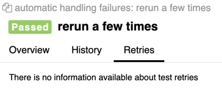
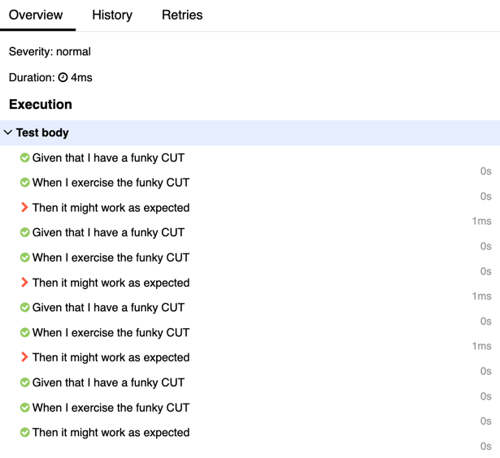

# behave-demo

## Why reruns are important?

- Reruns are not meant to _fix_ test flakiness, because they really don't. However, they are a
  powerful ally to stabilize build execution (which is a symptom caused by test flakiness). This is
  even more critical when build times are costly because the whole build execution is penalized by a
  few false positive (e.g., a fail that does not represent a real bug).
- By rerunning failing tests, we can expose failures that are real and be more tolerant with
  failures that were a result of an unstable testing environment.

## Approach #1 - Patching scenarios with rerun max attempts

* In this approach, we assume that every scenario is a potential flaky test. Therefore, before
  execution, we set the scenario to rerun a given number of times if it fails:

environment.py:

```{python}
# environment.py
def before_feature(_, feature: Feature):
  print("BEFORE FEATURE Run")
  print(f"- feature_name=\"{feature.name}\" status=\"{feature.status}\"")
  for scenario in feature.scenarios:
      patch_scenario_with_autoretry(scenario, max_attempts=5)
```

Output:

```
% behave -i ./features/flaky.feature
BEFORE FEATURE Run
- feature_name="automatic handling failures" status="Status.untested"
Feature: automatic handling failures # features/flaky.feature:1

  Scenario: rerun a few times      # features/flaky.feature:3
    Given that I have a funky CUT  # features/steps/flaky.py:8 0.000s
    When I exercise the funky CUT  # features/steps/flaky.py:16 0.000s
    Then it might work as expected # features/steps/flaky.py:24 0.000s
      Assertion Failed: Expected to be >0.5 but was 0.20

AUTO-RETRY SCENARIO (attempt 1)

  Scenario: rerun a few times      # features/flaky.feature:3
    Given that I have a funky CUT  # features/steps/flaky.py:8 0.000s
    When I exercise the funky CUT  # features/steps/flaky.py:16 0.000s
    Then it might work as expected # features/steps/flaky.py:24 0.000s
      Assertion Failed: Expected to be >0.5 but was 0.39

AUTO-RETRY SCENARIO (attempt 2)

  Scenario: rerun a few times      # features/flaky.feature:3
    Given that I have a funky CUT  # features/steps/flaky.py:8 0.000s
    When I exercise the funky CUT  # features/steps/flaky.py:16 0.000s
    Then it might work as expected # features/steps/flaky.py:24 0.000s
      Assertion Failed: Expected to be >0.5 but was 0.23

AUTO-RETRY SCENARIO (attempt 3)

  Scenario: rerun a few times      # features/flaky.feature:3
    Given that I have a funky CUT  # features/steps/flaky.py:8 0.000s
    When I exercise the funky CUT  # features/steps/flaky.py:16 0.000s
    Then it might work as expected # features/steps/flaky.py:24 0.000s
      Assertion Failed: Expected to be >0.5 but was 0.31

AUTO-RETRY SCENARIO (attempt 4)

  Scenario: rerun a few times      # features/flaky.feature:3
    Given that I have a funky CUT  # features/steps/flaky.py:8 0.000s
    When I exercise the funky CUT  # features/steps/flaky.py:16 0.000s
    Then it might work as expected # features/steps/flaky.py:24 0.000s
AUTO-RETRY SCENARIO PASSED (after 5 attempts)
AFTER FEATURE Run
- feature_name="automatic handling failures" status="Status.passed" failed="True"

1 feature passed, 0 failed, 0 skipped
1 scenario passed, 0 failed, 0 skipped
3 steps passed, 0 failed, 0 skipped, 0 undefined
Took 0m0.000s
```

The downside of this approach is that Allure does not know how to display this properly. So, only
looking at the summaries, you can't distinguish between reruns and passing tests unless you check
the execution.

<table>
  <tbody>
    <tr>
      <td></td>
      <td></td>
    </tr>
   <tbody>
</table>

## Approach #2 - Asking behave to generate failing scenarios to rerun

In this approach, we don't pragmatically ask behave to patch scenarios with retries (as in Approach
1).
